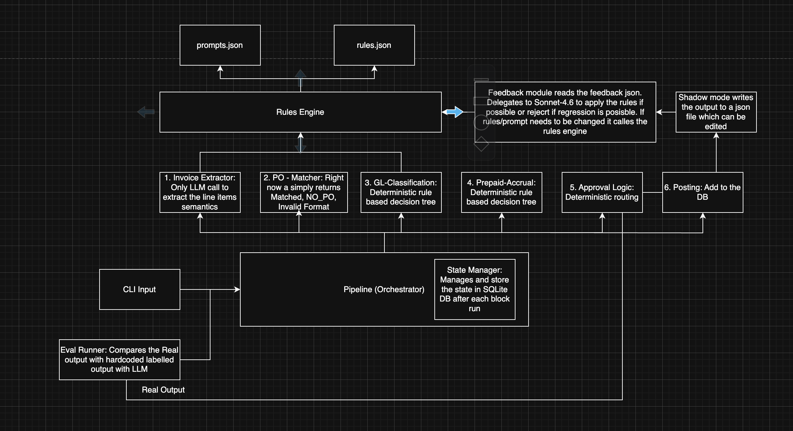
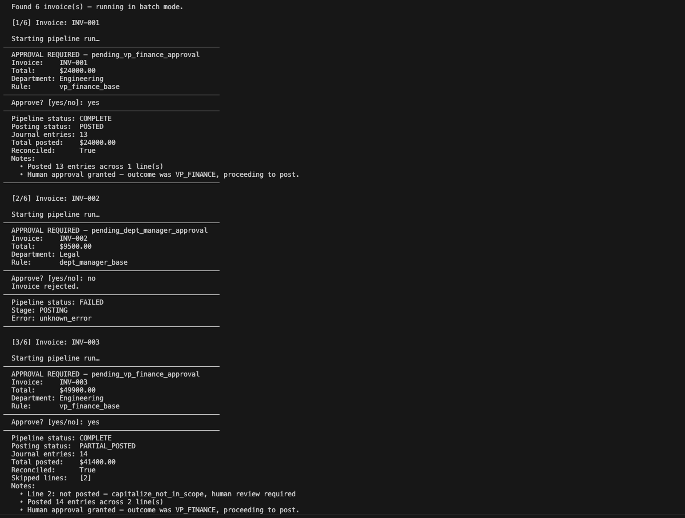
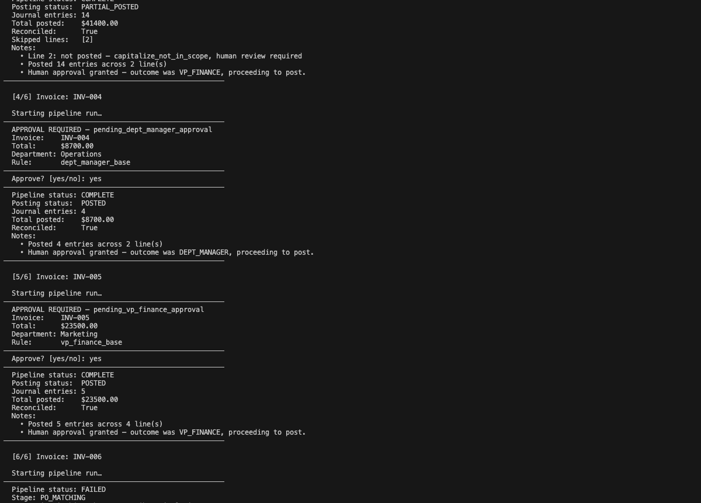
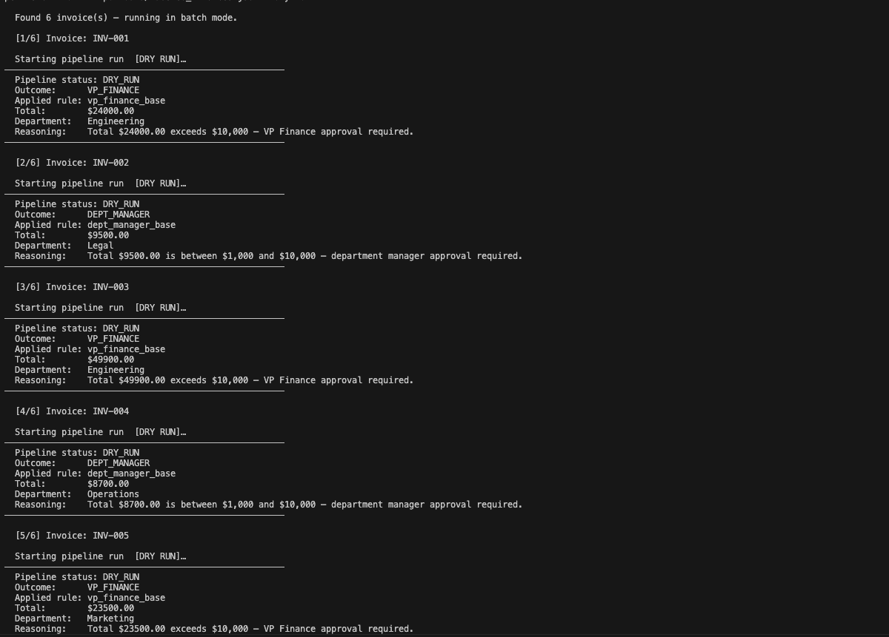
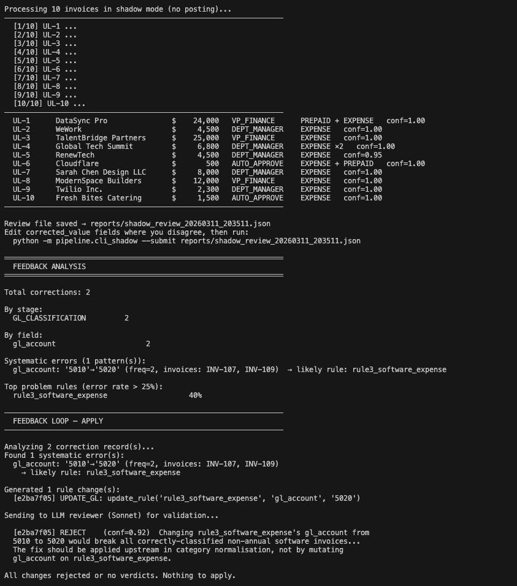

# Varick AP Automation Pipeline

Invoice processing pipeline that takes raw vendor invoices and turns them into GL-classified, approval-routed transactions. Built as a take-home for Varick.

---

## Architecture



The pipeline is straightforward — CLI takes an invoice, orchestrator runs it through 6 stages in order, state manager persists everything to SQLite after each stage. The rules engine sits above all of it and is what the stages actually use to make decisions.

Shadow mode runs invoices through dry-run, writes proposals to JSON. Reviewer corrects them. Feedback module picks up those corrections, finds patterns, and updates the rules engine. Eval runner validates nothing regressed.

---

## The 6 Stages

**1. Invoice Extractor**
The only stage that touches an LLM. Header parsing (vendor, date, total, PO, department) is all regex — no model. The haiku call is purely for line item semantics: quantity, unit cost, billing type, service period, category hint. One call per line. Everything else — validation, confidence scoring, state transitions — is deterministic Python.

Halts on: amount mismatch between line items and header, required header fields with zero confidence.
Flags and continues on: missing PO, future date, low-confidence descriptions.

**2. PO Matcher**
Simple format check. Returns `MATCHED`, `NO_PO`, or `INVALID_FORMAT`. That's it. No LLM, never halts. V1 intentionally — real PO lookup comes later.

**3. GL Classification**
Deterministic rule-based classifier. Loads `rules.json`, runs a 7-rule priority match on each line's signals (category hint, billing type, unit cost, amount). Assigns GL account and treatment. Halts if any line can't be matched.

**4. Prepaid / Accrual Recognition**
Same pattern as GL — deterministic rules, no LLM. Determines whether each line is a straight expense, prepaid to amortize, or accrual. Currently a stub but the runner is wired up.

**5. Approval Logic**
Deterministic routing based on total amount, department, and GL account composition. Thresholds load from `thresholds.json` on every call — so you can change routing behaviour without a deploy. Fail-closed: any error returns `DENY`.

**6. Posting**
Writes journal entries to the DB. Halts if approval hasn't been granted. Stub for now.

---

## Rules Engine

`rules.json`, `prompts.json`, and `thresholds.json` are the single source of truth for the whole pipeline. GL mappings, treatment rules, approval thresholds, and the haiku prompts all live here. The feedback loop updates these files directly — no code changes needed to adjust classification or routing behaviour.

---

## State & HITL

Every stage input/output is written to SQLite (`pipeline.db`) after it runs. On halt, the run is paused and a `halt_record` is stored. `orchestrator.resume(run_id, corrected_input)` picks it back up from where it stopped. For ingestion halts the serialized state is stored in the record so context isn't lost.

---

## Shadow Mode & Feedback Loop

- **Shadow mode** — runs invoices with `dry_run=True`, stops before posting, writes proposals to a JSON review file
- **Reviewer** corrects wrong classifications, treatments, or routing decisions
- **Feedback analyzer** finds systematic patterns (same wrong correction on 2+ invoices)
- **Rule refiner** proposes changes, simulates accuracy delta against labelled data, then applies to `rules.json` / `thresholds.json`
- **Benchmark** snapshots accuracy before and after so regressions are visible

The feedback module is all Python — no LLM involved in detecting patterns or applying changes.

---

## Repo Structure

```
invoice_extraction/     # Stage 1 — only LLM calls live here
po_matching/            # Stage 2 — format check
gl_classification/      # Stage 3 — rule-based classifier
prepaid_accrual/        # Stage 4 — accrual recognition (stub)
approval_routing/       # Stage 5 — deterministic routing
posting/                # Stage 6 — journal entry generation (stub)

pipeline/               # Orchestrator, SQLite layer, stage runners, shadow, CLI
rules_engine/           # Shared rule loading + SOP classifier
evals/feedback/         # Feedback loop: analyzer, refiner, benchmark, CLI

data/                   # Labelled + unlabeled invoice datasets
approval_routing/thresholds.json
rules_engine/rules.json
rules_engine/prompts.json

pipeline.db             # Auto-created on first run
```

---

## Usage

**Run an invoice through the full pipeline**
```bash
python -m pipeline.cli run --input data/labeled_invoices.json
```
Creates a new pipeline run, steps through all 6 stages in order, and writes each stage's input/output to `pipeline.db`. If the input file contains multiple invoices, it runs them in batch mode sequentially.

For invoices that require human approval (VP Finance, dept manager, etc.), the CLI pauses and prompts `Approve? [yes/no]` before proceeding to posting. This is the built-in HITL approval flow — the pipeline won't post until a human signs off. Rejecting an invoice at this point marks it as `FAILED` at the posting stage.




What you're seeing above is a batch run of 6 invoices:
- **INV-001** ($24k, Engineering) — VP Finance approval required → approved → `COMPLETE`, 13 journal entries posted
- **INV-002** ($9.5k, Legal) — dept manager approval required → rejected → `FAILED`
- **INV-003** ($49.9k, Engineering) — VP Finance approval required → approved → `PARTIAL_POSTED`, line 2 skipped (capitalize_not_in_scope, flagged for separate review)
- **INV-004** ($8.7k, Operations) — dept manager approval required → approved → `COMPLETE`, 4 entries posted
- **INV-005** ($23.5k, Marketing) — VP Finance approval required → approved → `COMPLETE`, 5 entries posted
- **INV-006** — failed at PO Matching stage

These results match the expected outputs in `data/labeled_invoices.json` for all 6 invoices — GL classifications, treatments, routing decisions, and posting outcomes are all correct against the ground truth labels.

**Run in dry-run mode**
```bash
python -m pipeline.cli run --input data/labeled_invoices.json --dry-run
```
Same as a normal run but stops before posting. No journal entries are written, no approval prompts. For each invoice it returns the routing outcome, the rule that was applied, and the reasoning — useful for validating that classification and routing logic is behaving correctly before committing anything to the DB.



Each invoice shows `[DRY RUN]` in the output and prints the pipeline status as `DRY_RUN` with the full routing decision — outcome, applied rule, total, department, and the exact reasoning string from the rules engine (e.g. `Total $24000.00 exceeds $10,000 — VP Finance approval required`). Nothing is paused for human input, nothing is posted.

The routing outcomes here — VP_FINANCE for INV-001, 003, 005 and DEPT_MANAGER for INV-002, 004 — match the expected routing decisions from the labels across all 6 invoices.

**Check the status of a run**
```bash
python -m pipeline.cli status --run-id <run_id>
```
Returns the full run history — every stage that ran, its status, and if the run is currently halted, the active halt record with the reason and which stage stopped it.

**Resume after a halt**
```bash
python -m pipeline.cli resume --run-id <run_id> --correction '{"total_amount": "3000"}'
```
Used after a human reviews a halt. Pass in the corrected field(s) as JSON. For ingestion halts (e.g. amount mismatch), this re-runs ingestion with the correction applied. For other stages, the correction is merged into the prior stage's output and execution continues from there.

**Run shadow mode on a batch of invoices**
```bash
ANTHROPIC_API_KEY=<key> python3 -m pipeline.cli_shadow --batch data/unlabeled_invoices.json
```
Runs each invoice through the pipeline in shadow mode (no posting). Prints a summary table — vendor, amount, routing outcome, treatment, and confidence — for every invoice, then saves the full proposals to a reviewable JSON file in `reports/`. Open that file, correct any fields you disagree with, and re-run with `--submit` to feed corrections back.

**Analyze feedback**
```bash
ANTHROPIC_API_KEY=<key> python3 -m evals.feedback.cli --analyze
```
Reads all accumulated correction records, groups them by stage and field, and surfaces systematic error patterns — corrections that appear on 2 or more invoices pointing to the same rule. Prints a breakdown of total corrections, which rules are causing errors, and error rates per rule.

**Analyze → review → simulate → apply (full loop)**
```bash
ANTHROPIC_API_KEY=<key> python3 -m evals.feedback.cli --apply
```
Runs the full feedback loop in one shot: detects systematic error patterns, generates rule change proposals, sends each proposal to a Sonnet reviewer for validation, simulates the accuracy delta on labelled data, and applies only the changes that pass review. If Sonnet rejects a proposed change (e.g. it would break correctly-classified invoices elsewhere), that change is skipped and nothing is written.



What you're seeing above is the full shadow → feedback → apply flow on `data/unlabeled_invoices.json` (10 invoices):

**Shadow run** — all 10 invoices processed, routing outcomes and treatments printed. Review file saved to `reports/shadow_review_20260311_203511.json`.

**Feedback analysis** — 2 corrections were submitted. Both on `GL_CLASSIFICATION`, both on `gl_account`. Analyzer found 1 systematic pattern: `gl_account 5010→5020` appearing on INV-107 and INV-109, pointing to `rule3_software_expense` as the likely cause (40% error rate on that rule).

**Apply** — generated 1 rule change proposal: update `rule3_software_expense` gl_account from 5010 to 5020. Sent to Sonnet reviewer, which **rejected it** (conf=0.92) — reasoning that the fix would break correctly-classified non-annual software invoices and the correction belongs upstream in category normalisation, not in the rule itself. Nothing was applied.

---

## Tradeoffs & Considerations

### Why not a full agent orchestrator?

The obvious alternative was one Sonnet agent driving the entire pipeline via tool use — receiving the invoice, deciding what to call next, handling edge cases, making classification and routing decisions itself. That approach was considered and dropped.

The core issue is that most of the pipeline doesn't need intelligence. PO matching is a string check. GL classification is a lookup against a rule table. Approval routing is a threshold comparison. Running a model over those steps would add latency, cost, and most importantly — non-determinism — to problems that have exact answers.

The decision was to limit LLM calls to exactly one place: extracting semantic signals from free-text line item descriptions. That's the only step where the input is genuinely unstructured natural language and regex won't cut it. Everything else is deterministic code.

**What this buys you:**
- When something classifies wrong, you look at `classify_line_signals()` and `rules.json`. The bug is locatable. With a full agent you'd be debugging why the model reasoned the way it did on that particular run.
- The feedback loop only works because the pipeline is a rules system. When the refiner proposes a change to `rules.json`, it can simulate the exact accuracy delta — same input, same output, every time. If the pipeline were agent-driven, "simulate a rule change" would mean re-running the model and hoping it responds consistently.
- Two runs of the same invoice should produce the same output. Auditability in AP means being able to explain every decision. Non-determinism makes that much harder.

**What you give up:**
- A full agent could improvise when an invoice format is genuinely novel. This pipeline halts and waits for a human — which is actually fine for AP, but it means the HITL path gets hit more often on weird inputs.

I believe the tradeoff was worth it. The goal was a system where every decision is traceable, testable, and improvable through a feedback loop that actually measures something. That's only possible if the pipeline is deterministic.

### Synchronous execution

Each stage waits for the previous one to fully complete before starting. Within ingestion, each line item is processed sequentially — haiku call for line 0 finishes before line 1 starts. At the batch level, invoice #2 doesn't start until invoice #1 has gone through all 6 stages.

This is fine at low volume. It's simple to reason about, easy to debug, and the SQLite write-after-each-stage approach works cleanly because there's no concurrency to manage.

The natural next step as input volume grows is a queue-based async model — invoices get pushed onto a queue, workers pick them up and run the pipeline independently, and results are written to the DB as each invoice finishes rather than waiting for the full batch to complete. Within ingestion specifically, the haiku calls per line are also a candidate for async — they're independent of each other and could be fired in parallel, which would meaningfully reduce latency on invoices with many line items.

The synchronous design was a deliberate starting point. The pipeline's stage boundaries and SQLite-backed state are already structured in a way that would make a queue-based approach a clean migration — each stage runner is self-contained, inputs and outputs are serialized at every boundary, and the orchestrator controls sequencing. Swapping the sequential loop for a worker-queue model wouldn't require rethinking the core architecture.

### Haiku for extraction, not Sonnet

The line item extraction step uses `claude-haiku` rather than Sonnet. The task is purely value extraction — read a free-text description like "Annual SaaS licence — Salesforce CRM Q1" and pull out structured fields: quantity, unit cost, billing type, service period, category hint. There's no logic involved, no decision to make, no ambiguity to reason through. The answer is either in the text or it isn't.

Haiku is fast and cheap at exactly this kind of structured extraction. Sonnet would produce the same output at 5-10x the cost and latency. Since there's one call per line item and invoices can have many lines, using Sonnet here would make the ingestion stage both slow and expensive without any quality benefit.

The one place Haiku can fall short is genuinely ambiguous or poorly written descriptions — but those cases are already handled: the result comes back with a low confidence score, the line gets flagged, and a human reviews it. The model doesn't need to reason its way through ambiguity; it just needs to surface that the ambiguity exists.

### Sonnet for the feedback reviewer

The feedback loop uses `claude-sonnet-4-6` specifically for the rule change reviewer step — the part where a proposed change to `rules.json` or `thresholds.json` is validated before being applied.

This is the opposite problem from extraction. The reviewer isn't pulling values out of text — it's reasoning about second-order effects. A proposed change like "update `rule3_software_expense` gl_account from 5010 to 5020" looks correct in isolation (two invoices had the wrong account), but the reviewer needs to think about whether that same rule is used for other invoice types, whether the correction would break currently-correct classifications, and whether the real fix belongs somewhere else in the rule chain entirely.

That kind of cross-cutting reasoning — understanding what a rule change means in the context of the full rule set — is exactly what Sonnet is better at. The feedback output above shows this working: Sonnet rejected the proposed change at conf=0.92, correctly identifying that the fix would break non-annual software invoices and that the correction should be applied upstream in category normalisation instead. A smaller model would likely have approved it.

### Centralised state store owned by the pipeline

State — every stage's input, output, and status — is managed exclusively by the pipeline orchestrator and written to SQLite via the state manager. Individual blocks (GL classification, approval routing, etc.) don't touch the state store directly. They receive their input, do their work, and return a result. The orchestrator decides what to persist and when.

This matters more as you move toward an async pipeline. If each block could read and write state independently, you'd have multiple workers potentially writing to the same run concurrently — last write wins, partial updates, race conditions on stage status. Keeping state changes in one place (the orchestrator) means there's a single path through which state transitions happen, which is much easier to reason about and audit.

The cost of this design shows up when a block's output schema changes. Say GL Classification starts returning an extra field — `amortization_schedule` — that didn't exist before. The block returns it, but unless the orchestrator and state manager are updated to handle that field, it either gets silently dropped during serialisation or causes a schema mismatch when the next stage tries to read it. The change isn't self-contained to the block — it ripples into the state store, the stage runner, and anything downstream that reads from it.

In practice this means output schema changes require coordinated updates across the block, the stage runner, and the state manager. The centralisation that makes the pipeline safe under concurrency is the same thing that makes individual block changes more expensive to propagate. A versioned output schema per stage — where the state store knows which version of each stage's output it's holding — would help contain those changes, but that's additional infrastructure on top of what's here.

### No file locking during feedback apply

When the feedback loop applies a rule change, it writes directly to `rules.json` or `prompts.json` on disk. There's no lock on those files. If the main pipeline happens to be running at the same time — reading `rules.json` mid-write — it could pick up a partially written file and either crash or silently classify with malformed rules.

In practice this is manageable at low volume: you'd just avoid running feedback apply while invoices are being processed. But it's a real race condition, not a theoretical one, and it gets harder to manage as volume increases.

The cleaner fix is a versioned metadata server sitting in front of the rule files. The server maintains multiple versions of `rules.json` and `prompts.json`. The main pipeline always reads from the current stable version. When the feedback loop wants to apply a change, it writes a new version, validates it, and atomically promotes it to current — the old version stays available until the swap completes. Any pipeline run that started before the swap keeps reading the old version until it finishes; new runs pick up the new one. No partial reads, no crashes, and you get version history as a side effect — so if a rule change turns out to be wrong you can roll back to any prior version without needing to reconstruct it from benchmark snapshots.

---

## Stack

- Python 3.13
- `anthropic==0.84.0` — haiku for line item extraction only
- SQLite (stdlib) — no external DB
